# Introduction

Welcome to the Kittn API! You can use our API to access Kittn API endpoints, which can get information on various cats, kittens, and breeds in our database.

We have language bindings in Shell, Ruby, and Python! You can view code examples in the dark area to the right, and you can switch the programming language of the examples with the tabs in the top right.

This example API documentation page was created with [Slate](https://github.com/tripit/slate). Feel free to edit it and use it as a base for your own API's documentation.


# Authentication

> To authorize, use this code:

```ruby
require 'kittn'

api = Kittn::APIClient.authorize!('meowmeowmeow')
```

```python
import kittn

api = kittn.authorize('meowmeowmeow')
```

```shell
# With shell, you can just pass the correct header with each request
curl "api_endpoint_here"
  -H "Authorization: meowmeowmeow"
```

```javascript
const kittn = require('kittn');

let api = kittn.authorize('meowmeowmeow');
```

> Make sure to replace `meowmeowmeow` with your API key.

Kittn uses API keys to allow access to the API. You can register a new Kittn API key at our [developer portal](http://example.com/developers).

Kittn expects for the API key to be included in all API requests to the server in a header that looks like the following:

`Authorization: meowmeowmeow`

<aside class="notice">
You must replace <code>meowmeowmeow</code> with your personal API key.
</aside>


# Event tracking

## Introduction
For event tracking we are using [mixpanel](http://www.mixpanel.com). Mixpanel is a tool that let us create user events and export data from them. Below you will find all the needed info to create `custom events`, `funnels` and `analyze data` based on your needs.<br/><br/>

Full API reference can be found [here](https://mixpanel.com/help/reference)

## Create an event
To create an event you should call the `track` method and passing the event name and/or properties. Here is an example in Javascript, more languages are provided on the languages section on the side.

`mixpanel.track("Press CTA");`

```javascript
// Send a "Played song" event to Mixpanel
// with a property "genre"
mixpanel.track(
    "Played song",
    {"genre": "hip-hop"}
);
```

## Create an event (no coding)
Mixpanel tracks any movement of every user automatically. Those events are not displayed on Mixpanel dashboard unless you name the ones you like to appear.

### Set up tracking
On your mixpanel dashboard select your name from the top right and press `Set up tracking`.

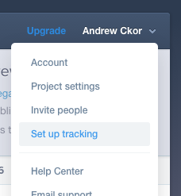

### Select Platform
In the next screen select the platform you want:

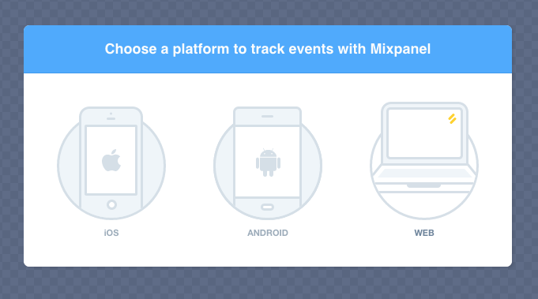

### Select page
Type or select the page the event happens, to load it and name the event.

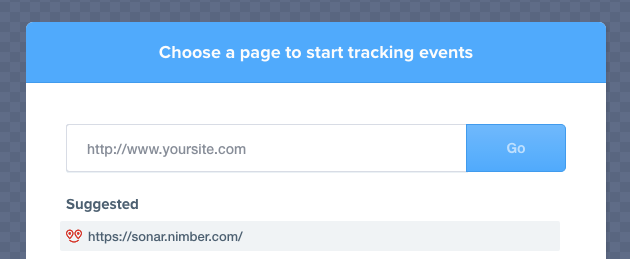

### Create an event
In the autotrack view, press `Create event`.

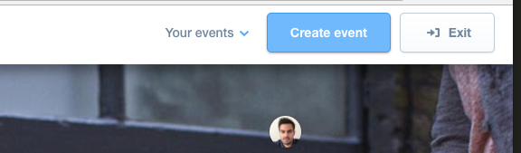

And then select the button/link/image/text you want to track as `click`.<br/>
Select a `name`, this is the name will appear in your event list on mixpanel dashboard.<br/>
And press save.<br/>
And then exit

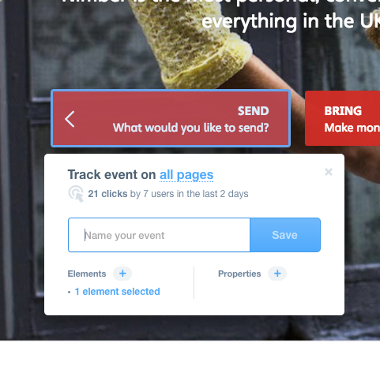

### Check that works
When you have saved the event and exited the autotrack mode, go back to your dashboard and select segmentation.

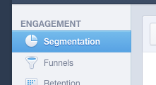

And then inside the dropdown menu you can find your event. <br/>
Select it and you see the data history in a graph below.

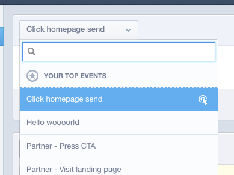


That's it! You just created your first event.

## Create a funnel (no coding)
Funnels let you track conversions on a specific set of actions. To create a funnel (no coding needed) you do it straight from the [mixpanel dashboard](https://mixpanel.com/report/1108498/funnels/).

### Prerequisite
To create a funnel you must have sent all the needed events to mixpanel before. During step creation every event should already exists in the mixpanel data.

### Good to know before you start
All Mixpanel funnels are based on __unique users, not total events sent__. The number you see for a step in a funnel is the number of your customers who completed that step of the funnel. Customers are only counted through the funnel once over the selected timespan of the funnel, even if they complete the funnel multiple times. <br/><br/>

The customer does steps A -> B -> C -> D -> E in exact order. Mixpanel __will count__ this as a conversion.<br/><br/>

The customer does steps A -> B -> F -> C -> D -> E. Mixpanel __will count__ this as a conversion. This is an example of loose ordering.<br/><br/>

The customer does steps A -> B -> C -> E. Mixpanel __will not count__ this as a full conversion, and the customer will not appear in the funnel after step C. The customer's completion of step E is excluded from the funnel because step D did not occur.<br/><br/>

Mixpanel does not have a way to designate optional steps in the Funnel builder. However, there are two approaches that will allow you to analyze different, perhaps optional, steps that a user could take along the way:
<ol>
  <li>Leverage Custom Events* in your Funnel to look at users who did Event A OR Event B.</li>
  <li>Create multiple Funnels representing different possible user paths and compare the conversion rates between them to see which steps produce the highest conversion. For example, if your funnel is A-B-C-D and A, D are mandatory but B, C aren't, your first funnel would simply be the conversion from A to D. Then your other funnels could be A-B-D, A-C-D, A-B-C-D, etc.</li>
</ol>

TIP: Mixpanel Funnels require that the steps you designate be completed in loose order. This means that a customer can engage in other actions in between steps as long as they ultimately complete all the Funnel steps in the correct order.

### Go to Funnels page
To create a funnel go to [Funnels page](https://mixpanel.com/report/1108498/funnels/)

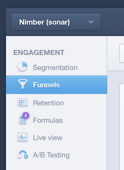

### Create a funnel
Press the + button to add a new funnel (don't pay attention to the purple icon of the screenshot, it's because of the free version).

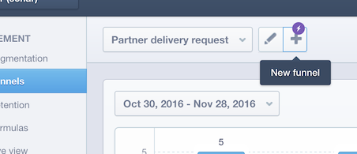


### Name the funnel
Add a name to your funnel.

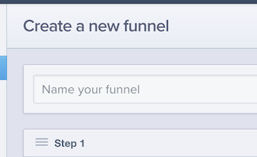

### Add a step
To add a step press the dropdown and select the event name for your step. It's recommended to __don't press__ custom event. Custom events are more advanced combination of different events and rules, more information can be found [here](https://mixpanel.com/help/questions/search?q=custom+event). Repeat that for as many steps as needed.

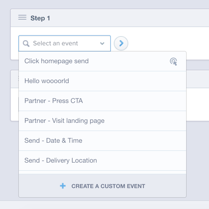

### Set convert time
Convert time is the available time you give to the user to complete the funnel in order to count as valid. Default is 30 days, but you can select whatever fits your funnel. For example, a signup funnel might be valid through a day or week, but a time you give to users to upload their driving license is higher, 1-3 months.

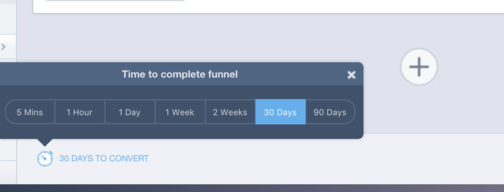

### Save the funnel
When all your steps are in place just press `Save` and your funnel is ready presenting and collecting data.

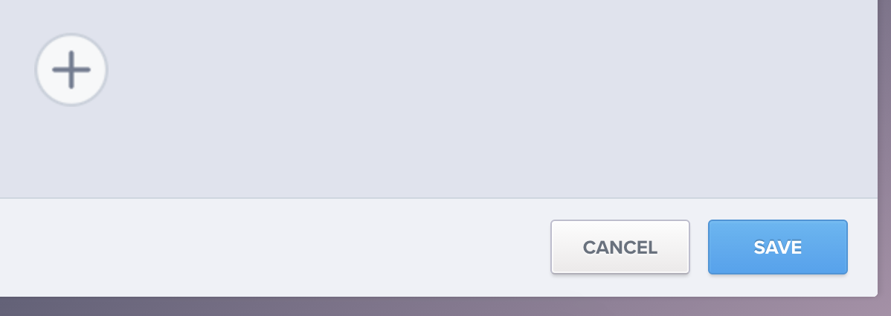


# Tasks

## Create an offer

```ruby
require 'kittn'

api = Kittn::APIClient.authorize!('meowmeowmeow')
api.kittens.get
```

```python
import kittn

api = kittn.authorize('meowmeowmeow')
api.kittens.get()
```

```shell
curl "http://example.com/api/kittens"
  -H "Authorization: meowmeowmeow"
```

```javascript
const kittn = require('kittn');

let api = kittn.authorize('meowmeowmeow');
let kittens = api.kittens.get();
```

> The above command returns JSON structured like this:

```json
[
  {
    "id": 1,
    "name": "Fluffums",
    "breed": "calico",
    "fluffiness": 6,
    "cuteness": 7
  },
  {
    "id": 2,
    "name": "Max",
    "breed": "unknown",
    "fluffiness": 5,
    "cuteness": 10
  }
]
```

This endpoint creates an offer (referred to the api as `job_action`) to a task.

### HTTP Request

`GET http://example.com/api/kittens`

### Query Parameters

Parameter | Default | Description
--------- | ------- | -----------
include_cats | false | If set to true, the result will also include cats.
available | true | If set to false, the result will include kittens that have already been adopted.

<aside class="success">
Remember — a happy kitten is an authenticated kitten!
</aside>

## Get a Specific Kitten

```ruby
require 'kittn'

api = Kittn::APIClient.authorize!('meowmeowmeow')
api.kittens.get(2)
```

```python
import kittn

api = kittn.authorize('meowmeowmeow')
api.kittens.get(2)
```

```shell
curl "http://example.com/api/kittens/2"
  -H "Authorization: meowmeowmeow"
```

```javascript
const kittn = require('kittn');

let api = kittn.authorize('meowmeowmeow');
let max = api.kittens.get(2);
```

> The above command returns JSON structured like this:

```json
{
  "id": 2,
  "name": "Max",
  "breed": "unknown",
  "fluffiness": 5,
  "cuteness": 10
}
```

This endpoint retrieves a specific kitten.

<aside class="warning">Inside HTML code blocks like this one, you can't use Markdown, so use <code>&lt;code&gt;</code> blocks to denote code.</aside>

### HTTP Request

`GET http://example.com/kittens/<ID>`

### URL Parameters

Parameter | Description
--------- | -----------
ID | The ID of the kitten to retrieve